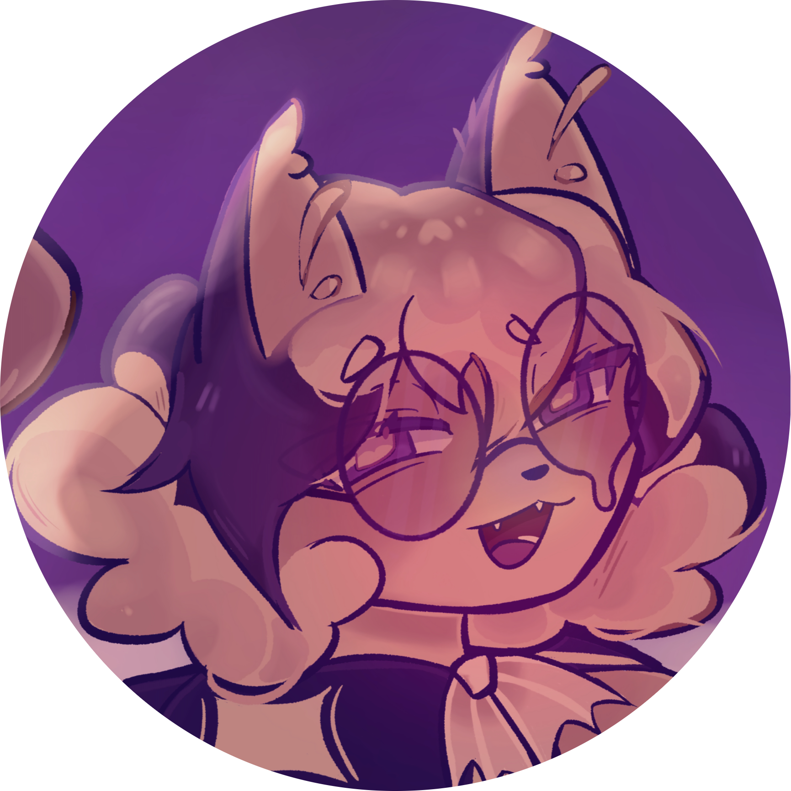
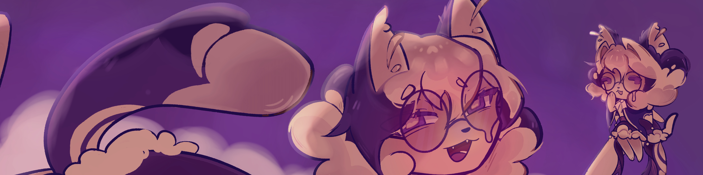

<!-- Worii's Information! -->
<!-- Complete revision from the first one, issue with the first was that I used set pixels instead of percentage
for width and is the reason why the about me looks weird. Trying to fix it will take a while but I think I need
to redo the entire bit just for a safe bet that I've really double checked-->
<!-- ==================== LEFT COLUMN (35%) ==================== -->
<table> <tr>
<!-- ==================== LEFT COLUMN (35%) ==================== -->
<td width="35%" valign="top">

  <!-- Welcome banner -->
  

  <!-- Profile image -->
  

  <!-- Badges -->
  

  
  
  
  

  <!-- Quote -->
  
  </a>

  

  <!-- My Information heading -->
  

    
  

  <!-- Stats block -->
  
  

  

  

  <!-- Bottom image with Byebye! -->
  
  

    
  

  

</td>

<!-- ==================== RIGHT COLUMN (65%) ==================== -->
<td width="65%" valign="top">

  

  <!-- Name heading -->
  <a>
    

      <a href="https://git.io/typing-svg">
        
      

    

  </a>

  <!-- "Description" section header -->
  

  <!-- Likes/Dislikes and the Worii Whimsical Tale, side by side -->
  <table width="100%">
    <tr>
      <td width="30%" valign="top">
        
      </td>
      <td width="70%" valign="top">
        
      </td>
    </tr>
  </table>

  <!-- "Hall of Fame" section header (for friendzzz) -->
  

    
  

  <!-- Items grid -->
  <table width="100%">
    <tr>
      <td width="33%">
        </td>
      <td width="33%">
        
      </td>
      <td width="33%">
        
      </td>
    </tr>
    <tr>
      <td width="33%">
        
      </td>
      <td width="33%">
        
      </td>
      <td width="33%">
        
      </td>
    </tr>
  </table>

  <!-- Banner -->
  

</td>
</tr> </table>
<!--
**Julcarya/Julcarya** is a ✨ _special_ ✨ repository because its `README.md` (this file) appears on your GitHub profile.

Here are some ideas to get you started:

- 🔭 I’m currently working on ...
- 🌱 I’m currently learning ...
- 👯 I’m looking to collaborate on ...
- 🤔 I’m looking for help with ...
- 💬 Ask me about ...
- 📫 How to reach me: ...
- 😄 Pronouns: ...
- ⚡ Fun fact: ...
-->
