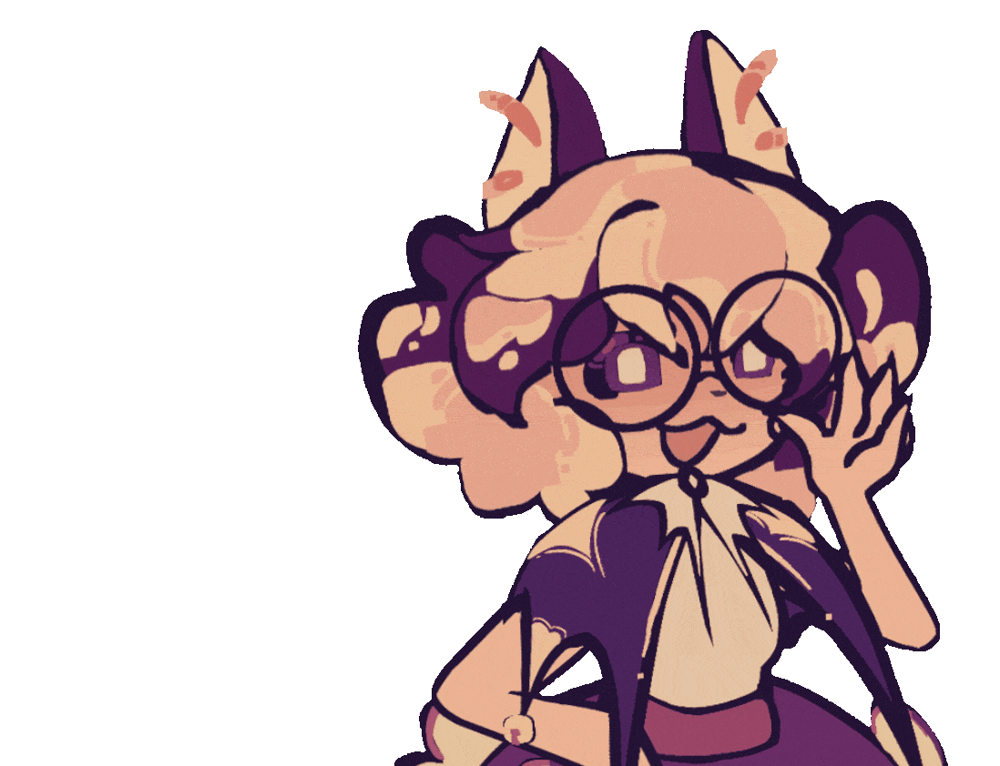

<!-- Worii's Information! -->

<table cellspacing="0" cellpadding="0" border="0">
  <tr>
    <!-- LEFT COLUMN -->
    <td width="35%" valign="top">
      
      
      
      
      

        <table width="100%" cellspacing="0" cellpadding="0" border="0">
      </table>
      
      
        
    </td>
    <!-- RIGHT COLUMN -->
    <td width="65%" valign="top">
      

      <a>

  
        

      

      </a>
      
      <!-- Standalone 2-column description, separate table -->
      <table width="100%" cellspacing="0" cellpadding="0" border="0">
        <tr>
          <td width="30%" valign="top"></td>
          <td width="70%" valign="top">
            
          </td>
        </tr>
      </table>
       
      

            <table width="100%" cellspacing="0" cellpadding="0" border="0">
        <tr>
          <td>Item 1</td>
          <td>Item 2</td>
          <td>Item 3</td>
        </tr>
        <tr>
          <td>Item 4</td>
          <td>Item 5</td>
          <td>Item 6</td>
        </tr>
      </table>
      
    </td>
  </tr>
</table>
<!--
**Julcarya/Julcarya** is a ✨ _special_ ✨ repository because its `README.md` (this file) appears on your GitHub profile.

Here are some ideas to get you started:

- 🔭 I’m currently working on ...
- 🌱 I’m currently learning ...
- 👯 I’m looking to collaborate on ...
- 🤔 I’m looking for help with ...
- 💬 Ask me about ...
- 📫 How to reach me: ...
- 😄 Pronouns: ...
- ⚡ Fun fact: ...
-->
